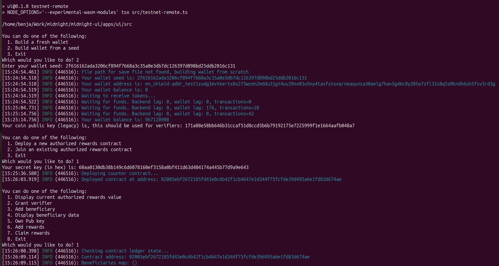
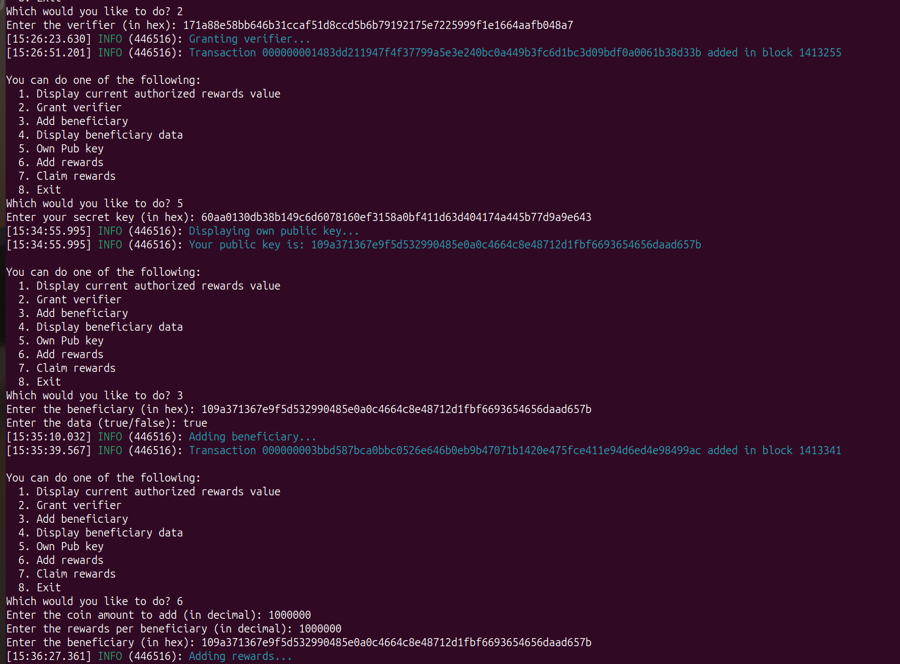
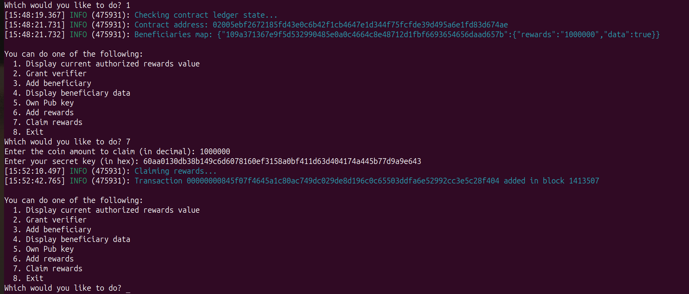

# Medical Verification System

A transparent, secure and privacy-preserving protocol for medical data validation and sharing built on the Midnight Network. This system enables medical verifiers (doctors, medical institutions) to add beneficiaries for government benefits while maintaining data privacy through zero-knowledge proofs.

## Overview

The system consists of three main actors:
- **Government**: Manages rewards/benefits and authorizes medical verifiers
- **Medical Verifiers**: Doctors or medical institutions who can verify medical conditions
- **Patients/Beneficiaries**: Individuals who can claim government benefits based on verified medical conditions

### Key Features

- **Privacy-Preserving**: Uses zero-knowledge proofs to verify medical conditions without exposing sensitive health data
- **Transparent**: All goberment expenses and rewards are recorded on-chain, ensuring accountability.
- **Secure**: Built on Midnight Network's privacy-focused infrastructure
- **Flexible**: Supports verification of any medical condition that can be validated by healthcare professionals

## Architecture

The project is structured as a monorepo with:
- `packages/contract/`: Smart contract written in Compact language for Midnight Network
- `apps/ui/`: React-based user interface for interacting with the contract
- CLI tool for programmatic interactions

## Prerequisites

- Node.js 22 (use `nvm use 22`)
- pnpm package manager (install with `npm install -g pnpm@latest-10`)
- Docker (for proof server)
- http-server (install with `npm i -g http-server`)

## Setup Instructions

Follow these steps in order:

### 1. Start Proof Server
```bash
docker run -p 6300:6300 midnightnetwork/proof-server -- 'midnight-proof-server --network testnet'
```
Keep this running in a separate terminal.

### 2. Environment Setup
```bash
# Switch to Node.js 22
nvm use 22

# Install global dependencies
npm i -g http-server
npm install -g pnpm@latest-10
```

### 3. Project Setup
```bash
# Clone and navigate to project
git clone https://github.com/FranZavalla/midnight-ui
cd midnight-ui

# Clean any previous builds
pnpm -w run clean

# Install and build contract
cd packages/contract
pnpm i
pnpm build

# Install and build UI
cd ../../apps/ui
pnpm i
pnpm turbo build
```

### 4. Running the Application

**For Web Server:**
```bash
cd apps/ui
pnpm run build:start
```

**For CLI Interface:**
```bash
cd apps/ui
pnpm run start-cli
```

## Important Notes

- The proof server must be running before starting the application
- All commands should be run in the order specified above
- The setup process compiles the Compact contract and generates zero-knowledge proof keys and circuits
- The UI build includes all contract artifacts needed for operation

## Usage

### Web Interface

1. Start the development server:
```bash
cd apps/ui
pnpm run dev
```

2. Open your browser to the provided URL (typically http://localhost:5173)

3. The interface provides different views for each user type:
   - **Government**: Add rewards and authorize verifiers
   - **Doctor**: Verify medical conditions and add beneficiaries
   - **Patient**: View status and claim available rewards

### CLI Interface

For programmatic access, use the CLI tool:

```bash
cd apps/ui
pnpm run testnet-remote
```

#### CLI Operations

The CLI provides an interactive menu system with the following options:

**Initial Setup:**
1. **Deploy a new contract**: Creates a new medical verification contract instance
2. **Join existing contract**: Connect to an already deployed contract using its address

**Main Operations:**

1. **Display current authorized rewards value**: View total rewards available in the system
2. **Grant verifier**: Authorize a medical professional to verify conditions
   - Requires verifier's public key (hex format)
3. **Add beneficiary**: Register a patient as eligible for benefits
   - Requires beneficiary's public key and medical verification status (true/false)
4. **Display beneficiary data**: View registered beneficiaries and their status
5. **Own Pub key**: Display your public key from your secret key
6. **Add rewards**: Government function to deposit rewards into the system
   - Requires coin amount and rewards per beneficiary
7. **Claim rewards**: Allow beneficiaries to claim their allocated benefits
   - Requires coin amount to claim and beneficiary's secret key

#### Example CLI Workflow

1. **Government Setup** (first time):
   ```
   1. Deploy a new authorized rewards contract
   → System generates contract address and your secret key
   6. Add rewards (deposit initial benefits)
   2. Grant verifier (authorize medical professionals)
   ```

2. **Medical Verifier**:
   ```
   2. Join an existing authorized rewards contract
   → Enter contract address and your secret key
   3. Add beneficiary (verify patient's medical condition)
   ```

3. **Patient/Beneficiary**:
   ```
   2. Join an existing authorized rewards contract
   4. Display beneficiary data (check your status)
   7. Claim rewards (if eligible)
   ```

#### CLI Workflow Screenshots

**Initial Setup and Contract Deployment**

*Starting the CLI, building wallet, and deploying a new medical verification contract*

**Verifier Authorization and Beneficiary Management** 

*Granting verifier permissions, generating public keys, and adding beneficiaries with medical verification*

**Rewards and Claims Processing**
 
*Government funding rewards, viewing beneficiary data, and processing reward claims*

### Key Management and Privacy

#### Key Types
- **Secret Keys**: hex strings used for authentication and transaction signing
- **Legacy Coin Public Key**: Used for verifier authorization - this is displayed when building a wallet and should be used when granting verifier permissions
- **Public Key (from Secret Key)**: Generated from secret key using option 5 in CLI - used for beneficiary identification and claiming rewards
- **Contract Address**: Unique identifier for each deployed contract instance

#### Privacy Protection
The system ensures privacy through:
- **Beneficiary Anonymity**: Only the beneficiary and their verifying doctor know the connection between a public key and the actual person's identity
- **Zero-Knowledge Verification**: Medical conditions are verified without exposing the actual medical data
- **Pseudonymous Transactions**: All on-chain interactions use public keys rather than real identities

#### Testing Configuration
For testing purposes:
- The **government wallet** that deploys the contract can add itself as a verifier using its legacy coin public key
- The same wallet can then add beneficiaries (including itself) using the public key derived from its secret key
- This allows complete end-to-end testing with a single wallet acting as government, verifier, and beneficiary

**Security Note**: Keep your secret keys secure and never share them publicly.

## Development

### Running Tests

```bash
# Contract tests
cd packages/contract
pnpm test

# UI tests (if available)
cd apps/ui
pnpm test
```

### Linting

```bash
# Root level
pnpm run lint

# Individual packages
cd packages/contract && pnpm run lint
cd apps/ui && pnpm run lint
```

### Type Checking

```bash
# Root level
pnpm run check-types

# UI specific
cd apps/ui && pnpm run typecheck
```

## License

Apache-2.0
